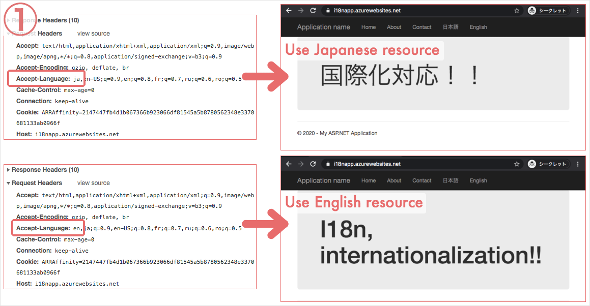
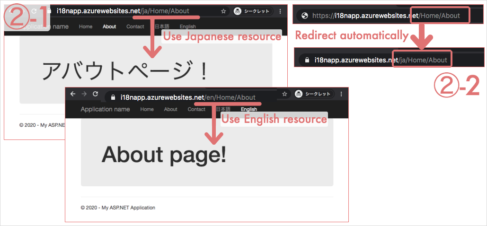
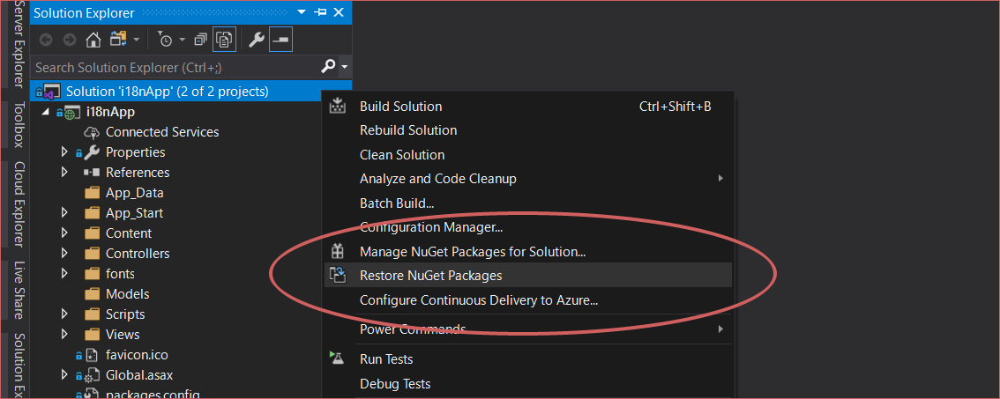

i18nApp C#
===

Internationalization application served by C# ASP.NET MVC on Azure and is deployed through DevOps.

## What this project includes

1. **/Home/Index** that switches its language depending on http request header: Accept-Language
2. **/Home/About** that
    1. switches its language depending on its URL such as /ja/Home/About and /en/Home/About
    2. redirects to /{default culture}/Home/About automatically
3. **/Home/Contact** that
    - is same as About page

## Installation

After cloning the repository, restore Nuget packages.

